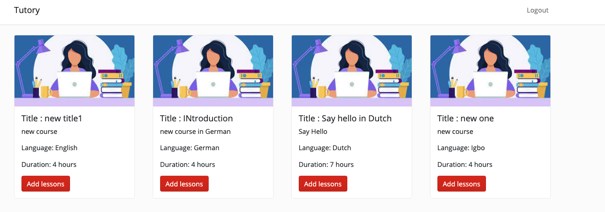

## Welcome to Tutory

### About Tutory

Tutory is a language learning app, created to help make language learning experience fun by pairing up real time with fellow language learners after courses have been created by tutors.

As a tutor you can create new language courses of varying course durations.  

After creating courses you can add lessons, quizzes and videos which are automatically uploaded to AWS cloud services.

### Getting started 🚀

The app uses Amazon web services to save images and videos. The details are found in the .env.example

**What you need:**

- A code editor (Visual Studio Code)
- Web browser (Firefox, Chrome)

#### Back end

1. Open the server folder and run `<npm i>` in the terminal.
2. Start the server by typing `<nodemon>` or `<node>` in your terminal.
3. This will launch the server and connect you to the database!

- Use the example.env to set up env variables.

#### Front end

1. Open the client folder and run `<npm i>` in the terminal.
2. Start the app by typing `<npm start>`.
    

The app should start in your browser in the default port 3000.

### Tech stack 👩‍💻

Tutory was created using:

**Front end:** React, Redux, React-Bootstrap. 
**Back end:** Express, Node.js, MongoDB, Mongoose.

## Welcome to Tutory
